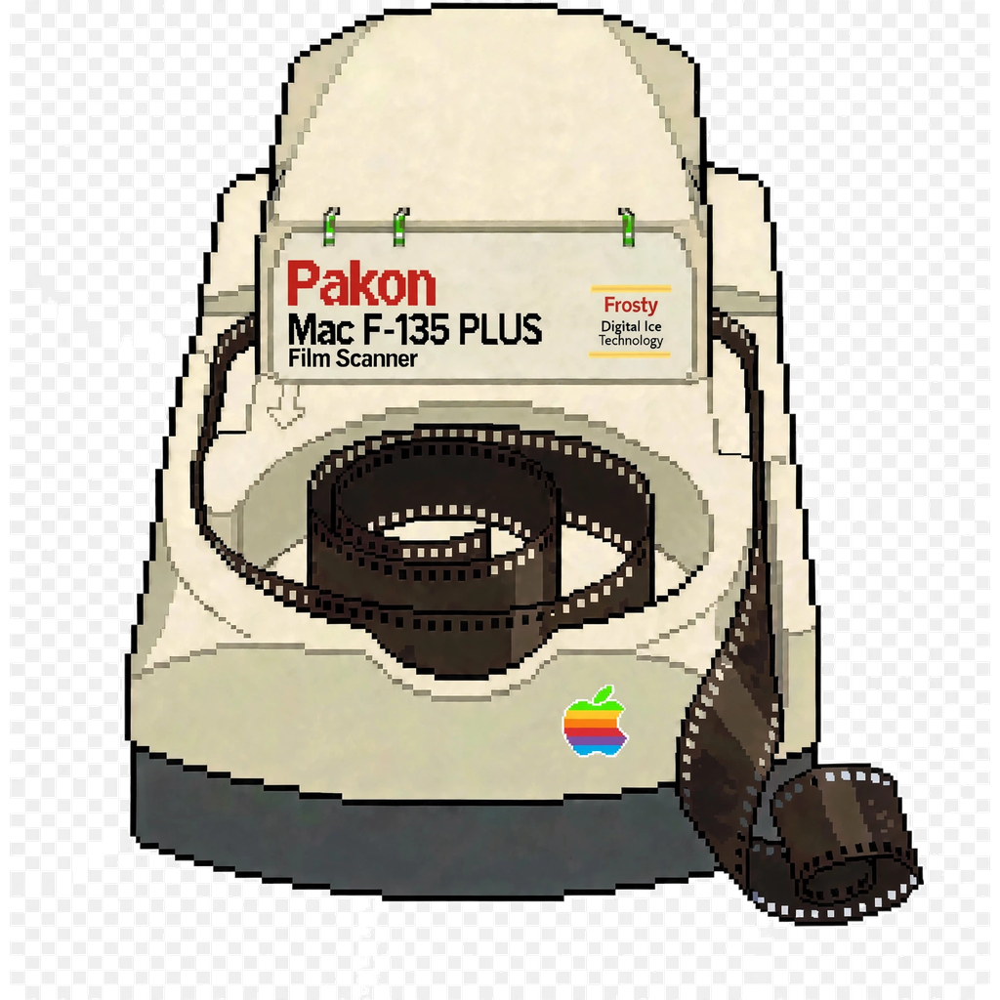

  

  

# pakon-mac

**⚠️ WARNING ⚠️**
The application and some of the image processing pipelines are **NOT working 100% yet**. This repository is highly experimental and in active development. Please do not run this or attempt to interface with your scanner unless you know exactly what you are doing.

**Colour is currently in progress.** The F-135 negative→positive inversion
is fixed and verified against the vendor's own ICC output. The tone stage
feeding it (`AnsShastaCapabilityImpl::analyze`) is still a two-anchor
stand-in — `ShastaAnalyzePorted = false` in both pipelines — and is being
ported from the vendor binary now, Unicorn-verified leaf by leaf. Expect
rendered colour to change as that lands.

**The Electron app UI is not finished.** It exists to exercise the scan and
decode pipeline end to end, not as a polished product yet — expect rough
edges, placeholder screens, and controls that don't do anything yet.

Native macOS support for Kodak/Pakon F-135, F-235 and F-335 film scanners.

These scanners shipped in 2002–2007 with 32-bit Windows XP drivers and have no
vendor support on any modern OS. This project documents the hardware interface
and reimplements the host side in userspace on macOS.

## Status

Active development. See [`docs/06-roadmap.md`](docs/06-roadmap.md) for where things stand.

## Telemetry

This application collects basic, anonymous telemetry (OS version, app version, and unhandled errors) to help identify bugs and crashes. It does **not** collect any personal data, IP addresses, capture imagery, or paths to your files.

**To opt out:** Set the `PAKON_TELEMETRY_OPT_OUT=1` environment variable when running the app.

## Architecture & Pipelines

This project includes two separate imaging pipelines for processing the raw scanner data:
1. **Python Pipeline**: The original research and reference implementation (`tools/pakon_render.py`). Uses NumPy for processing.
2. **Go Pipeline**: The newer, production-oriented implementation (`tools/ansel/pipeline/`). This is significantly faster than the Python version due to being a compiled language with better multi-threading and memory management for heavy image operations.

## Hardware Backups & Repair (`backups/`)

This repository contains raw hardware dumps from a Pakon scanner in the `backups/` folder. These are preserved here for anyone attempting to repair a bricked scanner:
- **`eeprom-i2c/`**: Dumps of the I2C EEPROM chips. `eeprom_52.bin` contains the irreplaceable per-unit optical/motor calibration data, while `eeprom_51.bin` holds the FX2 boot personality.
- **`u11-picl/`**: PIC18 firmware dumps of the U11 Light Control chip. Critically, this contains a real, un-patched Kodak factory bootloader.
- **`u34-picm/`**: PIC18 firmware dumps of the U34 Motor Control chip. 

*See the `README.md` inside each subfolder for exact memory maps, SHA256 checksums, and flashing notes.*

The Windows kernel drivers (`F235Ldr.sys`, `F235Lib.sys`, `F135usb2.sys`) are
generic USB plumbing — a firmware loader and a bulk-pipe passthrough. None of
the scanner logic lives in kernel space; it all lives in userspace DLLs
(`tlx.dll` → `TLA/TLB/TLC.dll`) that push packets through a single
`DeviceIoControl`.

That means **macOS needs no kernel extension and no DriverKit driver.**
Everything can be done from userspace with libusb.

## Documentation

| Doc | Contents |
|---|---|
| [`00-overview.md`](docs/00-overview.md) | System architecture, Windows stack, porting strategy |
| [`01-usb-layer.md`](docs/01-usb-layer.md) | VID/PID table, enumeration states, endpoint map |
| [`02-firmware.md`](docs/02-firmware.md) | EZ-USB firmware load, scanner sub-processor firmware |
| [`03-protocol.md`](docs/03-protocol.md) | Command packet format, addresses, status codes |
| [`04-api-surface.md`](docs/04-api-surface.md) | The TLX API — operations, parameters, error codes |
| [`05-source-material.md`](docs/05-source-material.md) | What's in the vendor distribution and where |
| [`06-roadmap.md`](docs/06-roadmap.md) | Implementation plan, open questions, how to help |

## Provenance and confidence

Every claim in these docs is tagged:

- **[VERIFIED]** — read directly out of a vendor binary or data file in this
  repo's source material. Reproducible with the scripts in `tools/`.
- **[INFERRED]** — deduced from naming, structure, or cross-referencing two
  sources. Probably right, not proven.
- **[EXTERNAL]** — from third-party reverse engineering (see credits). Not
  independently confirmed here.
- **[UNKNOWN]** — called out explicitly so gaps aren't mistaken for coverage.

Nothing here has been tested against real hardware yet. Treat all of it as a
map, not a guarantee.

## Credits

Kyle Kaufman's [Pakon reverse engineering
write-up](https://ktkaufman03.github.io/blog/2022/09/04/pakon-reverse-engineering/)
established the command packet framing, the address enum, and the identification
of `F235Ldr.sys` as Anchor Chips' ezloader. Facts taken from it are tagged
**[EXTERNAL]**.

## Legal

Not affiliated with Kodak, Eastman Kodak Company, or Pakon in any way.
Kodak and Pakon are trademarks of their respective owners.

This is hobby reverse engineering. I'm not responsible for damage to your
scanner, your film, or anything else. Use it at your own risk.
